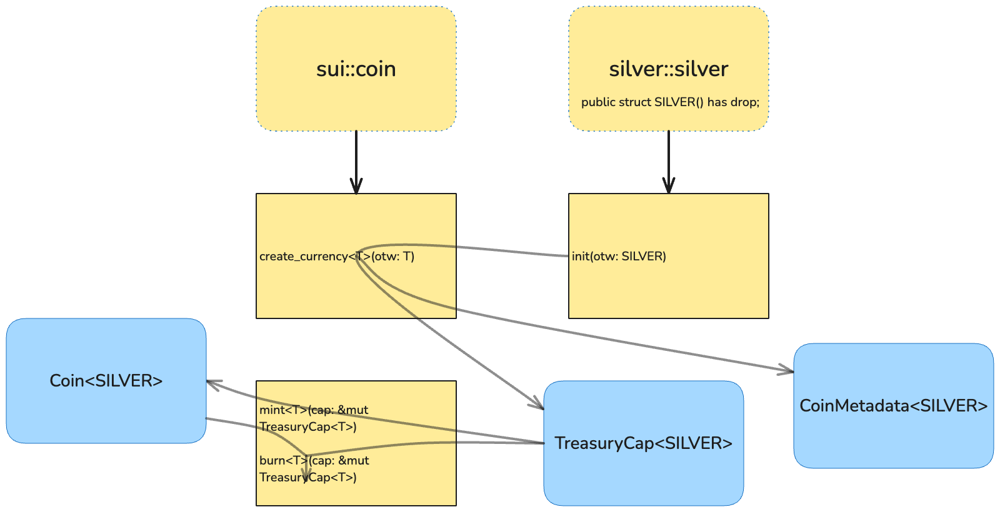

# [I1]: Silver Coin

## What You Will Learn

In this section, you will learn the basics of creating a simple fungible token in Sui Move. You will:

- Define a new fungible token with custom metadata
- Use minting and burning functionality

This exercise provides a foundation for understanding fungible token mechanics in Sui Move.

In this section we will work with the implementation of a Silver coin that can be used as currency in our game.

## Project Structure

The codebase consists of several key components:

1. `silver/sources/silver.move` - Contains the Silver coin implementation
2. `silver/Move.toml` - Package configuration and dependencies

## Tasks to Complete

There are three main tasks to implement in this project:

### 1. Create Silver Currency
In `silver.move`, implement the `create_silver_currency` function to create a new currency with:
- 9 decimals
- "Silver" as name
- "SILVER" as symbol
- A description and icon URL

### 2. Implement Minting
In `silver.move`, implement the minting functionality in the test to:
- Create a coin of specified amount
- Verify the total supply is updated correctly

### 3. Implement Burning
In `silver.move`, implement the burning functionality in the test to:
- Burn a previously minted coin
- Verify the total supply is reduced correctly

## Useful Links

- [Coin Standard](https://docs.sui.io/standards/coin)
- [Create a Coin](https://docs.sui.io/guides/developer/coin)
