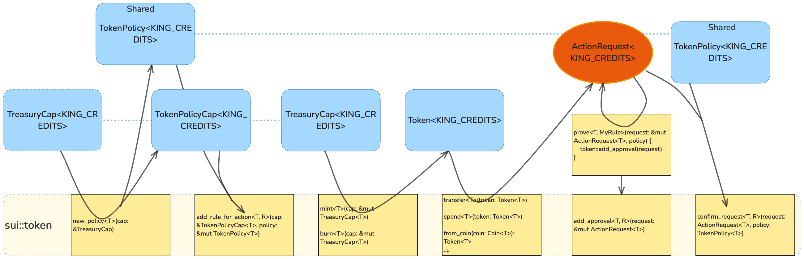

# [I3]: King Credits

## What You Will Learn

In this section, you will learn how to implement a governance-controlled token in Move, where transfers require approval using custom logic. You will:

- Initialize a Token with its corresponding Policy.
- Set a custom rule for transferring Tokens of this type.

By the end, you will understand how to design tokens with advanced, policy-driven transfer restrictions in Move.

In this section we will work with the implementation of King Credits, a token that can only be transferred with approval from the Crown Council.

## Project Structure

The codebase consists of several key components:

1. `king_credits/sources/king_credits.move` - Contains the King Credits token implementation
2. `king_credits/sources/crown_council_rule.move` - Contains the Crown Council rule implementation
3. `king_credits/Move.toml` - Package configuration and dependencies

## Tasks to Complete

There are four main tasks to implement in this project:

### 1. Initialize Token and Policy
In `king_credits.move`, implement the `init` function to:
- Create the King Credits currency
- Create a token policy with the Crown Council rule
- Set up the initial council configuration

### 2. Add Rule Configuration
In `crown_council_rule.move`, implement the `add_rule_config` function to:
- Initialize the rule configuration with initial council members
- Ensure the number of members doesn't exceed the maximum (100)

### 3. Manage Council Members
In `crown_council_rule.move`, implement:
- `add_council_member` to add new members to the council
- `remove_council_member` to remove members from the council

### 4. Implement Rule Proving
In `crown_council_rule.move`, implement the `prove` function to:
- Check if the action request sender is a council member
- Add approval for the rule if they are a member

## Useful Links

- [Closed Loop Token](https://docs.sui.io/standards/closed-loop-token)
- [In-Game Currency](https://docs.sui.io/guides/developer/coin/in-game-token)
- [Loyalty Token](https://docs.sui.io/guides/developer/coin/loyalty)
