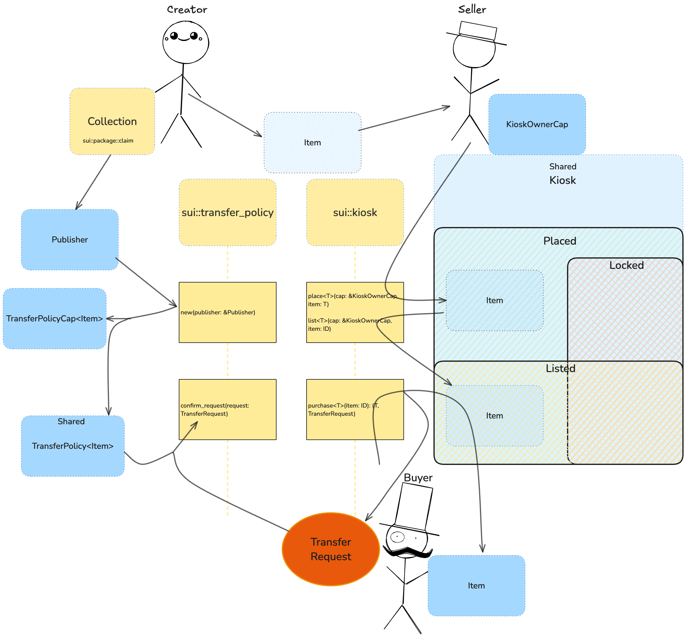

# [I4]: Sword trading

## What You Will Learn

In this section, you will learn how to implement a marketplace for NFTs using the Kiosk standard in Move. You will:

- Create a collection compatible with Kiosk trading
- Implement listing and sale logic using Kiosk primitives
- Handle secure transfers and purchases of NFTs between users
- Understand the structure and flow of a decentralized marketplace on Sui

By the end, you will be able to build and test a basic NFT marketplace with trading logic in Move.

In this section we will work with the implementation of a marketplace for trading Swords using Kiosk.

## Sword Contract

The Sword contract (`sword.move`) is a simple NFT implementation that creates swords with the following properties:
- Name
- Damage value
- Special effects (as a vector of strings)
- Display metadata (name, image URL, description)

## Project Structure

The codebase consists of several key components:

1. `src/publish.ts` - Handles package publishing and policy creation
2. `src/kiosk.ts` - Implements kiosk-related operations
3. `src/consts.ts` - Contains constants and configuration
4. `src/kiosk.test.ts` - Contains tests for kiosk operations

## Tasks to Complete

There are four main tasks to implement in this project:

### 1. Create Transfer Policy
In `src/publish.ts`, implement the `createPolicy` function to create an empty TransferPolicy for the Sword NFT.

### 2. Create Kiosk
In `src/kiosk.ts`, implement the `createKiosk` function to create a new kiosk.

### 3. Place and List Items
In `src/kiosk.ts`, implement the `placeAndListInKiosk` function to:
- Place a sword in a kiosk
- List it for sale at a specified price

### 4. Implement Purchase
In `src/kiosk.ts`, complete the `purchase` function to:
- Buy a sword from a kiosk
- Transfer it to the buyer's address

## Useful Links

- [Sui Kiosk](https://docs.sui.io/standards/kiosk)
